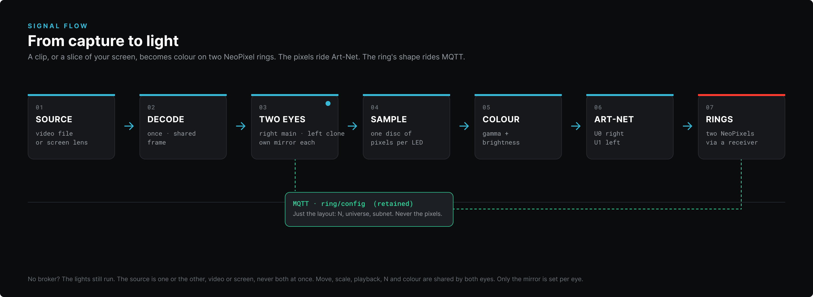
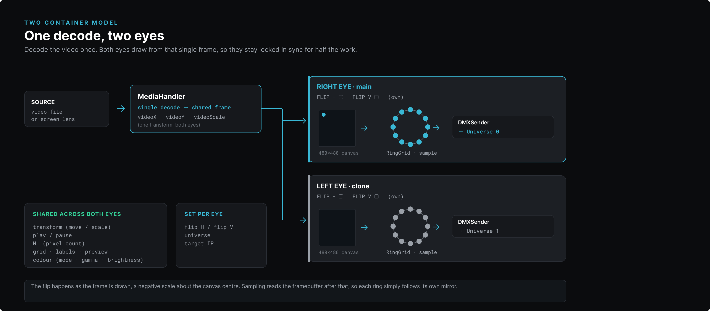
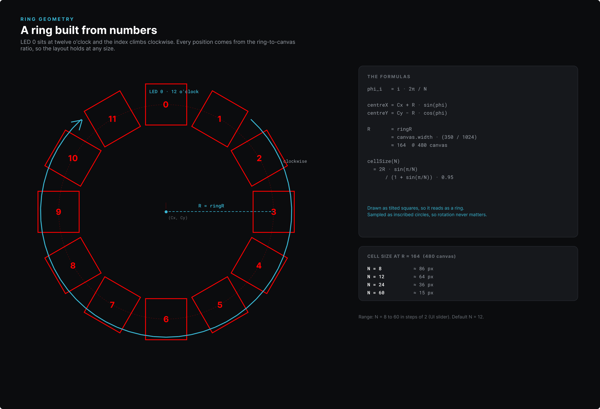
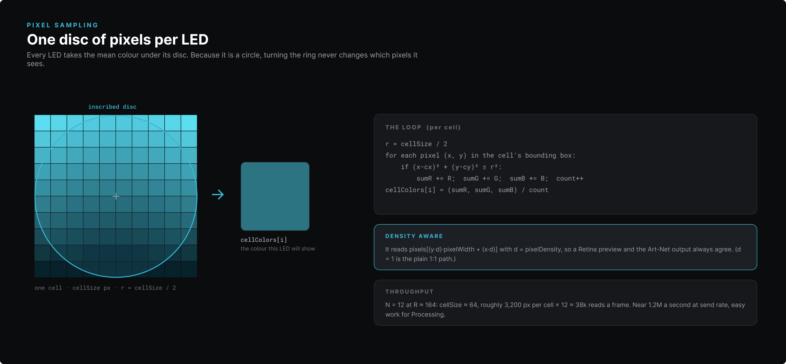
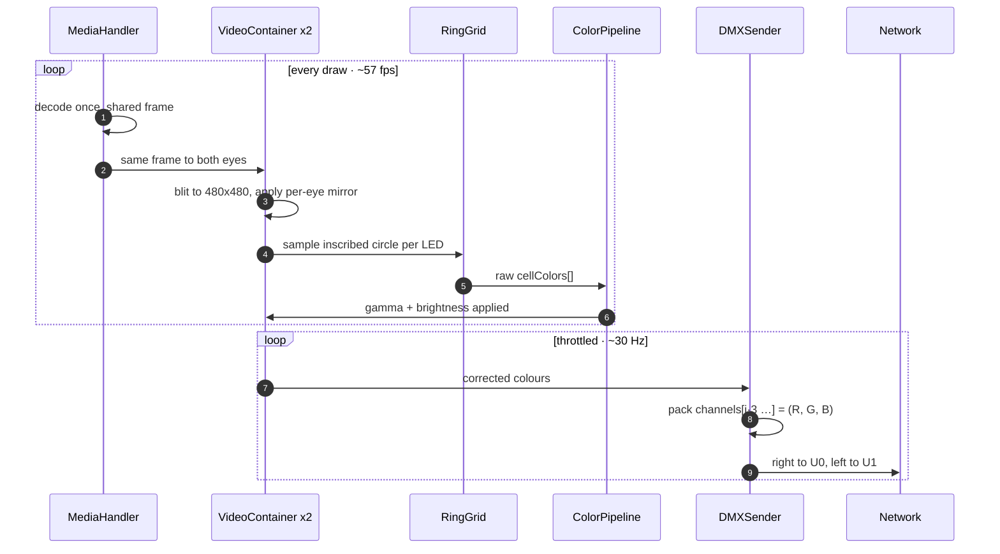
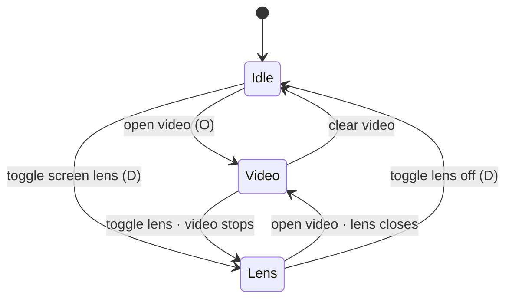
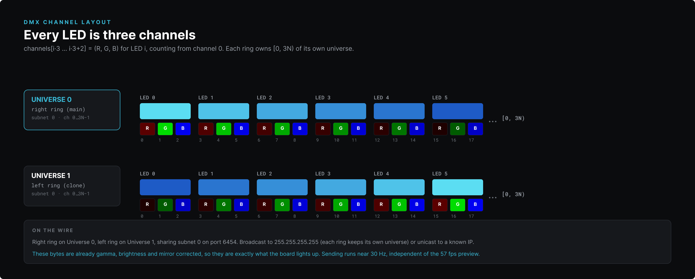
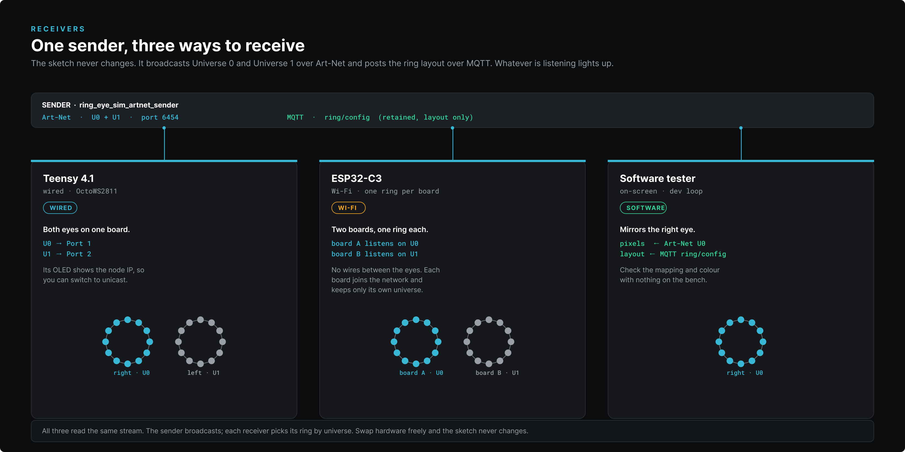

<div align="center">

# Ring Eye Sim · Pipeline deep-dive

**How one video clip, or one live region of your screen, becomes colour on two NeoPixel rings, frame by frame.**

</div>

---

This is the companion to the [README](README.md): the README shows you how to run it, this shows what happens inside. It serves two readers. If you design, the top half is yours: pictures, geometry, the reasoning. If you build hardware, the lower half has the channels, transport, and receivers.

---

## The whole path, at a glance



Seven stages, left to right. A **source** is decoded **once**, handed to **two eyes**, **sampled** per LED, **colour corrected**, then streamed as **Art-Net** to the **rings**. Pixels travel the solid lane. The dashed green lane is MQTT, which carries only the layout (`N`, universe, subnet), never pixels. Pull the broker and the lights keep running.

> The one idea that shapes everything else: **decode once, render twice.** Every stage downstream is just two copies of the same frame, each free to set its own mirror.

---

## One decode, two eyes



A single `MediaHandler` decodes the video (or grabs the screen region) into one shared frame, along with the shared transform (`videoX`, `videoY`, `videoScale`). That frame goes to **two** `VideoContainer`s: the **right eye** is the main, the **left eye** is its clone. Each draws the frame into its own 480×480 canvas and applies its own horizontal or vertical flip as it draws.

Because the flip lands **before** sampling, the sampler reads the framebuffer as it finds it. No special cases, no per-eye branches. Each ring follows its own mirror for free.

What's shared, and what's set per eye:

- **Shared:** transform (move, scale), play and pause, `N`, grid, labels, preview, and the whole colour stage (mode, gamma, brightness).
- **Per eye:** flip H, flip V, the Art-Net universe, and the target IP.

---

## The ring, defined by numbers



The ring isn't drawn by hand, it's parametric. **LED 0 sits at twelve o'clock and the index climbs clockwise.** Each LED's centre comes from its angle around the circle:

```
phi_i   = i · 2π / N
centreX = Cx + R · sin(phi_i)
centreY = Cy − R · cos(phi_i)
```

The radius is a ratio of the canvas, not a fixed pixel count, so the layout holds at any size:

```
R = ringR = canvas.width · (350 / 1024)   ≈ 164 px @ 480 canvas
```

Cell size shrinks as you add pixels, so neighbours never touch:

```
cellSize(N) = 2R · sin(π/N) / (1 + sin(π/N)) · 0.95
```

That's about 86 px at N = 8, 64 px at N = 12, 36 px at N = 24, and 15 px at N = 60. The slider runs **N = 8 to 60 in steps of 2**, default **12**. Cells are drawn as tilted squares so they read as a ring, then sampled as circles, which is the next stage.

---

## Reading colour: one disc per LED



For each LED, the sampler walks the pixels in the cell's bounding box, keeps the ones inside the inscribed disc, and averages them:

```
r = cellSize / 2
for each pixel (x, y) in the cell's bounding box:
    if (x − cx)² + (y − cy)² ≤ r²:
        sumR += R;  sumG += G;  sumB += B;  count++
cellColors[i] = (sumR, sumG, sumB) / count
```

A circle, not a square, keeps the answer **rotation independent**: turning the ring never changes which pixels a cell sees. It's also allocation free, just four running sums.

It's density aware, too. The read is `pixels[(y·d)·pixelWidth + (x·d)]` with `d = pixelDensity`, so a Retina preview (`d = 2`) and the Art-Net output agree (`d = 1` is the plain 1:1 path).

> A quick cost check: N = 12 at R ≈ 164 is roughly 3,200 pixels per cell, times 12, near 38k reads a frame. About 1.2M a second at send rate. Processing handles it without noticing.

---

## What happens each frame

Drawing and sending run at different rates. The sketch draws at roughly 57 fps for a smooth preview, while Art-Net is throttled to about 30 Hz so the network and receivers aren't flooded.



---

## Video or screen, never both

The source is either a loaded video or the live screen-capture lens, never both at once. Choosing one releases the other, so there's only ever a single frame producer feeding the pipeline.



> The lens is a transparent, resizable, always-on-top window. Drag it over anything on the desktop and that region flows into the same sampling path as a video.

---

## On the wire: Art-Net channels



Each LED is **three DMX channels**, packed from channel 0:

```
channels[i·3 … i·3+2] = (R, G, B)   for LED i
```

So a ring of `N` pixels owns channels `[0, 3N)` of its universe. The **right** eye sends on **Universe 0**, the **left** on **Universe 1**, sharing subnet 0 on port 6454. **Broadcast** to `255.255.255.255` and each ring keeps its own universe, or **unicast** to a known IP.

One thing worth knowing when you debug: the bytes on the wire are already gamma, brightness, and mirror corrected. They're exactly what the receiver lights up, so the preview is the truth.

---

## MQTT: the layout side-channel

Pixels never touch MQTT. The only thing published there is the ring **layout** (`N`, universe, subnet) on the topic `ring/config`, **retained** so a receiver that joins late still gets the current geometry. That's what lets a preview receiver mirror the ring's shape live as you change `N`.

It's optional. With no broker reachable, MQTT is skipped and **Art-Net is untouched**. The lights still run.

---

## Receivers: one sender, three ways



The sketch doesn't care what's listening. It broadcasts U0 and U1 and posts the layout, and any of three receivers can take it from there:

- **Teensy 4.1, wired, both eyes on one board.** A custom 4-port board drives both rings from one node (U0 to Port 1, U1 to Port 2). Its OLED shows the node IP, so you can move from broadcast to unicast.
- **ESP32-C3, Wi-Fi, one ring per board.** Each board joins the network and keeps a single universe, so two boards cover two eyes (board A on U0, board B on U1). No wires between the eyes.
- **Software tester, on-screen.** Mirrors the right eye, reading pixels over Art-Net (U0) and layout over MQTT. It's the bench tool for checking mapping and colour with nothing plugged in.

> Swap between them freely. The sender is identical every time; each receiver picks its ring by universe.

---

## Where this lives in the source

| Concern | File |
|---|---|
| Single decode, shared frame, transform | `MediaHandler` |
| Per-eye canvas, mirror, sampling host | `VideoContainer` (x2) |
| Ring geometry, inscribed-circle sampling | `RingGrid` |
| Gamma, brightness, colour mode | `ColorPipeline` |
| Channel packing, universe, broadcast or unicast | `DMXSender` |

These all sit in `Processing/ring_eye_sim_artnet_sender/`. Receivers live under `microcontroller/`, and the software tester under `Processing/tools/tailored_dmx_receiver/`.

---

<div align="center">

back to the [README](README.md)

</div>
