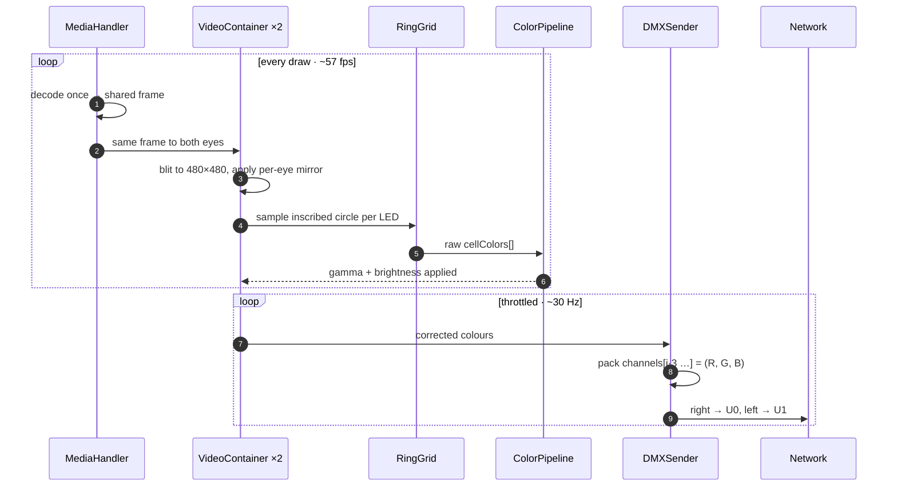
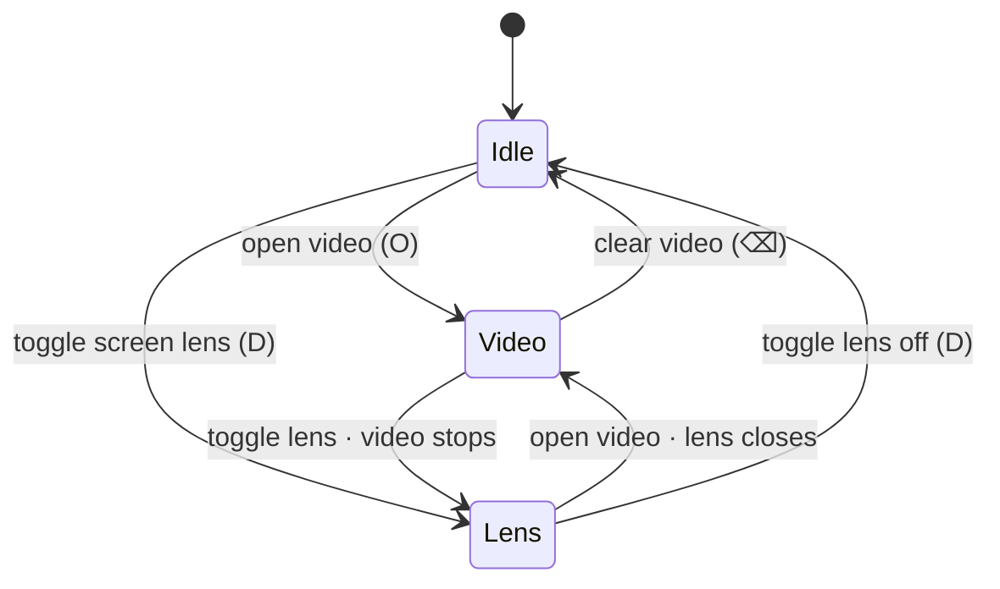

<div align="center">

# Ring Eye Sim · Pipeline deep-dive

**How one video clip — or one live region of your screen — becomes colour on two NeoPixel rings, frame by frame.**

</div>

---

This is the long-form companion to the [README](README.md). The README tells you how to run it; this tells you what happens inside. It's written for two readers at once: if you're a designer, the top half is for you — pictures, geometry, the *why*. If you're wiring up hardware, the lower half has the channels, transports, and receivers.

Every diagram below is a real export from the project's Figma working file, so the colours match what you see on the canvas: **cyan** is the *main* (right) eye, **red** is a live ring cell, **green** is the MQTT side-channel.

---

## The whole path, at a glance


Seven stages, left to right: a **source** is decoded **once**, handed to **two eyes**, **sampled** per LED, **colour-corrected**, and streamed as **Art-Net** to the **rings**. Pixels ride Art-Net (the solid lane). The dashed green lane is MQTT — it carries only the *layout* (`N`, universe, subnet), never the pixel data. Pull the broker and the lights keep running.

> The single most important idea in the whole project: **decode once, render twice.** Everything downstream is just two copies of the same frame, each allowed its own mirror.

---

## One decode, two eyes


A single `MediaHandler` decodes the video (or grabs the screen region) and produces one shared frame, plus the shared transform (`videoX`, `videoY`, `videoScale`). That frame is handed to **two** `VideoContainer`s — the **right eye** is the main, the **left eye** is its clone. Each blits the frame into its own 480×480 canvas and applies *its own* horizontal/vertical mirror at blit time.

Because the mirror happens **before** sampling, the sampler just reads whatever is in the framebuffer — no special cases, no per-eye branches. Each ring naturally follows its own flip.

What's shared versus what's per-eye is worth committing to memory:

- **Shared** across both eyes: transform (move / scale), play / pause, `N` (pixel count), grid · labels · preview, and the whole colour stage (mode · gamma · brightness).
- **Per-eye only:** flip H, flip V, the Art-Net universe, and the target IP.

---

## The ring, defined by numbers


The ring isn't drawn by hand — it's parametric. **LED 0 sits at 12 o'clock and indices increase clockwise.** Each LED's centre comes from its angle around the circle:

```
phi_i   = i · 2π / N
centreX = Cx + R · sin(phi_i)
centreY = Cy − R · cos(phi_i)
```

The radius is a *ratio* of the canvas, not a fixed pixel count, so the layout holds at any canvas size:

```
R = ringR = canvas.width · (350 / 1024)   ≈ 164 px @ 480 canvas
```

Cell size shrinks as you add pixels, so neighbours never overlap:

```
cellSize(N) = 2R · sin(π/N) / (1 + sin(π/N)) · 0.95
```

That lands at roughly 86 px for N = 8, 64 px for N = 12, 36 px for N = 24, and 15 px for N = 60. The UI slider runs **N = 8…60 in steps of 2**, default **12**. Cells are *drawn* as rotated radial squares (it reads as a ring), but *sampled* as inscribed circles — which is the next stage.

---

## Reading colour: one inscribed circle per LED


For each LED, the sampler walks the pixels inside the cell's bounding box and keeps only those within the inscribed disc, then averages them:

```
r = cellSize / 2
for each pixel (x, y) in the cell's bounding box:
    if (x − cx)² + (y − cy)² ≤ r²:
        sumR += R;  sumG += G;  sumB += B;  count++
cellColors[i] = (sumR, sumG, sumB) / count
```

A circle (not a square) keeps the result **rotation-invariant** — spinning the ring doesn't change which pixels a cell "sees." It's also allocation-free: just four running sums.

It's density-aware, too. The read is `pixels[(y·d)·pixelWidth + (x·d)]` with `d = pixelDensity`, so a Retina preview (`d = 2`) and the Art-Net output agree (`d = 1` is the plain 1:1 path).

> Cost check: N = 12 at R ≈ 164 is about 3,200 pixels per cell × 12 ≈ 38k reads per frame — around 1.2M reads/sec at the send rate. Nothing for Processing to sweat over.

---

## What happens each frame

Drawing and sending run at **different rates**: the sketch draws at roughly 57 fps for a smooth preview, but Art-Net is throttled to about 30 Hz so the network and receivers aren't flooded.



---

## Video or screen — never both

The source is *either* a loaded video *or* the live screen-capture lens, never both at once. Picking one releases the other, so there's only ever one frame producer feeding the pipeline.



> The screen lens is a transparent, resizable, always-on-top window — drag it over anything on the desktop and that region flows into the exact same sampling path as a video.

---

## On the wire: Art-Net channels


Each LED is **three DMX channels**, packed tight from channel 0:

```
channels[i·3 … i·3+2] = (R, G, B)   for LED i
```

So a ring of `N` pixels owns channels `[0, 3N)` of its universe. The **right** eye sends on **Universe 0**, the **left** eye on **Universe 1**, sharing subnet 0 on port 6454. You can **broadcast** to `255.255.255.255` (receivers tell themselves apart by universe) or send **per-eye unicast** to a known IP.

One detail that matters for debugging: the bytes on the wire are **post** gamma + brightness **and post** that eye's mirror — exactly what the receiver will light up. What you see in the preview is what the hardware gets.

---

## MQTT: the layout side-channel

Pixels never touch MQTT. The only thing published there is the ring **layout** — `N`, universe, subnet — on the topic `ring/config`, **retained** so a receiver that connects late still gets the current geometry. It exists so a preview receiver can mirror the ring's shape live as you change `N`.

It's strictly optional. With no broker reachable, MQTT is skipped and **Art-Net is never affected** — the lights still run.

---

## Receivers: one sender, three ways


The sketch doesn't care what's listening. It broadcasts U0 + U1 and publishes layout, and any of three receivers can consume that same stream:

- **Teensy 4.1 — wired, both eyes on one board.** A custom 4-port board drives both rings from a single node (U0 → Port 1, U1 → Port 2). Its OLED shows the node IP so you can switch from broadcast to unicast.
- **ESP32-C3 — Wi-Fi, one ring per board.** Each board joins the network and filters for one universe, so you flash two boards for two eyes (board A on U0, board B on U1). No wires between the eyes.
- **Software tester — on-screen.** Mirrors the right eye, reading pixels over Art-Net (U0) and layout over MQTT. It's the bench tool for verifying mapping and colour with no hardware plugged in.

> Swap freely between them — the sender is identical in every case. Receivers tell their ring apart by universe.

---

## Where this lives in the source

| Concern | File |
|---|---|
| Single decode · shared frame · transform | `MediaHandler` |
| Per-eye canvas · mirror · sampling host | `VideoContainer` (×2) |
| Ring geometry · inscribed-circle sampling | `RingGrid` |
| Gamma · brightness · colour mode | `ColorPipeline` |
| Channel packing · universe · broadcast/unicast | `DMXSender` |

All of the above are in `Processing/ring_eye_sim_artnet_sender/`. Receivers live under `microcontroller/`, and the software tester under `Processing/tools/tailored_dmx_receiver/`.

---

<div align="center">

← back to the [README](README.md)

</div>
