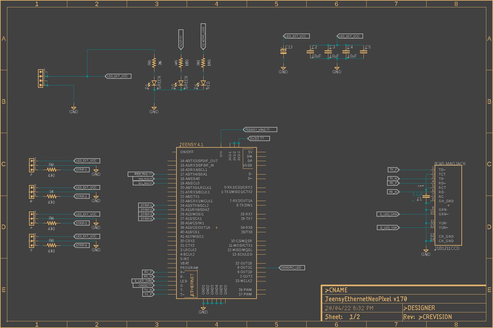
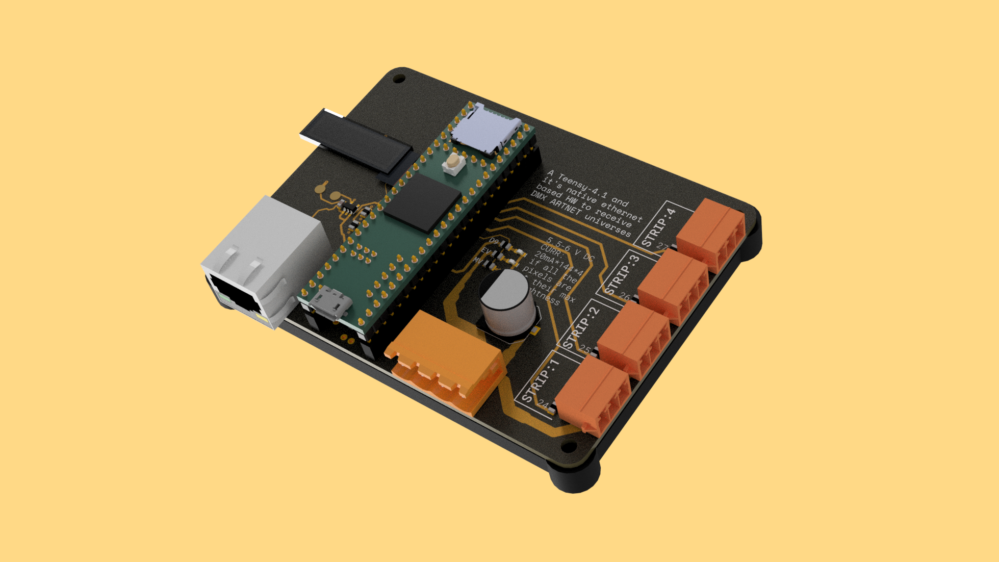
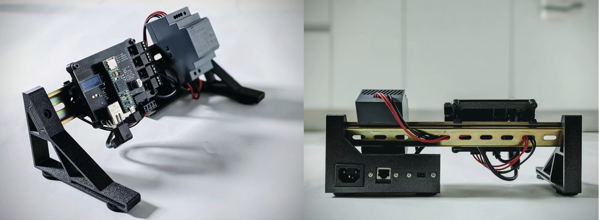

# README

__Platform:__ Teensy 4.1 @ 400MHz with Native Ethernet

An ARTNET based multi single strip neopixel (WS2811) system; running on Teensy 4.1 (using NativeEthernet and Artnet) where it receives DMX universe 0 and sets them parallel to all 4 strips

---

## Hardware Setup

1. Schematic: [Schematic.pdf](https://github.com/dattasaurabh82/ARTNET_TEENSY41_ETH_NEOPIXEL/blob/main/Schematic.pdf)



2. [GERBER](https://github.com/dattazigzag/ring_eye_sim/blob/main/microcontroller/ring_eye_sim_artnet_receiver_teensy41_pio/assets/GERBERS/TeensyEthernetNeoPixel%20v21%20v444_2022-04-11.zip)




## Development Environment Setup

### PIO specific instructions (from scratch) : 

  1. Needed to add manually Adafruit Busio lib from pio's library registry, to this project.
  2. Needed to add manually Adafruit GFX lib from pio's library registry, to this project.
  3. Needed to add manually Adafruit SSD1306 pio's library registry, to this project.
  4. In platformio.ini, in "lib_deps" section, add https://github.com/vjmuzik/NativeEthernet . (although is baked in Teensy System, but it might not be the latest)
  5. In platformio.ini, in "lib_deps" section, add https://github.com/natcl/Artnet . (May be available in pio lib registry, but it's not latest [as of Mar 20222])

  For 1st time:
  It will highlight in red complaining it can't find the following libraries in path, in some header files:
  ```c
    #include <Arduino.h>
    #include <SPI.h>
    #include <Wire.h>
    #include <Adafruit_GFX.h>
    #include <Adafruit_SSD1306.h>
   ```
  1. In vscode, in the appropriate header files, a small light bulb will appear, asking "Fix the quick way", do that (for both the libraries)
  2. Come back to main.cpp and compile, the errors would be gone.

---

#### Minimal [platformio.ini](https://github.com/dattasaurabh82/ARTNET_TEENSY41_ETH_NEOPIXEL/blob/main/platformio_alternative/teensy41_pio_artnet_demo/platformio.ini)

```yaml
[env:teensy41]
platform = teensy
board = teensy41
framework = arduino
board_build.mcu = imxrt1062
board_build.f_cpu = 600000000L ; max freq available on T4.1
monitor_speed = 115200
upload_protocol = teensy-cli ; teensy-gui is default also "jlink" is available
lib_deps = 
    SPI
    Wire
    https://github.com/vjmuzik/NativeEthernet
    https://github.com/natcl/Artnet
    adafruit/Adafruit NeoPixel@^1.10.4
    adafruit/Adafruit BusIO@^1.11.3
    adafruit/Adafruit GFX Library@^1.10.14
    adafruit/Adafruit SSD1306@^2.5.1
```

---

## License

[GNU Lesser General Public License](../../LICENSE)

---

## Credits:

1. PaulStoffregen : for the [Teensy platform](https://github.com/PaulStoffregen/cores) and initial Ethernet library.
2. Nathanaël Lécaudé : for the [Artnet library](https://github.com/natcl/Artnet)
3. vjmuzik: For the Native [Ethernet library](https://github.com/vjmuzik/NativeEthernet)
4. Adafruit : for the [Neopixel library](https://github.com/adafruit/Adafruit_NeoPixel)


